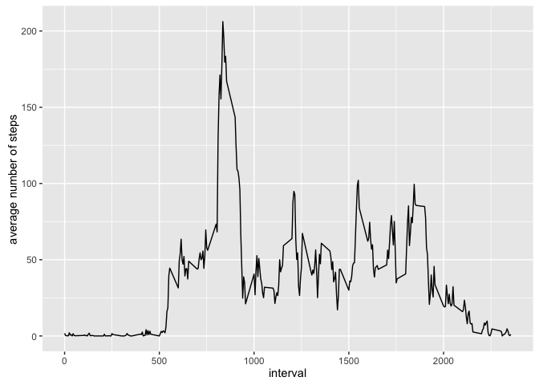

# Reproducible Research: Assignment 1


## Loading and preprocessing the data


The required libraries are loaded and the raw data is read in. The only transformation needed is to convert the date field into the related R date type.


```r
library(dplyr)
library(ggplot2)
library(lubridate)

activity.df <- tbl_df(read.csv(unz("activity.zip", "activity.csv"))) %>%
  mutate(date = ymd(date))
head(activity.df)
```

```
## Source: local data frame [6 x 3]
## 
##   steps       date interval
##   (int)     (date)    (int)
## 1    NA 2012-10-01        0
## 2    NA 2012-10-01        5
## 3    NA 2012-10-01       10
## 4    NA 2012-10-01       15
## 5    NA 2012-10-01       20
## 6    NA 2012-10-01       25
```

## What is mean total number of steps taken per day?

Calculate the total number of steps taken per day:


```r
steps.per.day <- activity.df %>%
  select(date, steps) %>%
  group_by(date) %>%
  summarize(total = sum(steps, na.rm=TRUE))
head(steps.per.day)
```

```
## Source: local data frame [6 x 2]
## 
##         date total
##       (date) (int)
## 1 2012-10-01     0
## 2 2012-10-02   126
## 3 2012-10-03 11352
## 4 2012-10-04 12116
## 5 2012-10-05 13294
## 6 2012-10-06 15420
```

A histogram of the total steps per day:


```r
ggplot(steps.per.day, aes(total)) +
  geom_histogram(binwidth=1000, colour="black", fill="white") +
  xlab('Total Steps Per Day') 
```

<!-- -->

Calculate and report the mean and median of the total number of steps taken per day


```r
steps.mean = mean(steps.per.day$total, na.rm = TRUE)
steps.median = median(steps.per.day$total, na.rm = TRUE)
```

The mean for the total steps is 9354.23, and the median is 10395.


## What is the average daily activity pattern?

Calculate the average number of steps taken per period:


```r
steps.per.period <- activity.df %>%
  select(interval, steps) %>%
  group_by(interval) %>%
  summarize(average = mean(steps, na.rm=TRUE))
head(steps.per.period)
```

```
## Source: local data frame [6 x 2]
## 
##   interval   average
##      (int)     (dbl)
## 1        0 1.7169811
## 2        5 0.3396226
## 3       10 0.1320755
## 4       15 0.1509434
## 5       20 0.0754717
## 6       25 2.0943396
```

Make a time series plot (i.e. type = "l") of the 5-minute interval (x-axis) and the average number of steps taken, averaged across all days (y-axis)


```r
ggplot(steps.per.period, aes(x = interval, y = average)) +
  geom_line() +
  ylab("average number of steps")
```

<!-- -->
    
Which 5-minute interval, on average across all the days in the dataset, contains the maximum number of steps?


```r
max.interval <- steps.per.period %>%
  arrange(desc(average))
head(max.interval)
```

```
## Source: local data frame [6 x 2]
## 
##   interval  average
##      (int)    (dbl)
## 1      835 206.1698
## 2      840 195.9245
## 3      850 183.3962
## 4      845 179.5660
## 5      830 177.3019
## 6      820 171.1509
```

The interval with the maximum number of steps is 835.

## Imputing missing values

Calculate and report the total number of missing values in the dataset (i.e. the total number of rows with NAs)


```r
sum(is.na(activity.df))
```

```
## [1] 2304
```

Devise a strategy for filling in all of the missing values in the dataset. The strategy does not need to be sophisticated. For example, you could use the mean/median for that day, or the mean for that 5-minute interval, etc.

    The NA values will be filled with the average value for that time period.

Create a new dataset that is equal to the original dataset but with the missing data filled in.


```r
activity.df.no.na <- activity.df %>% 
  full_join(steps.per.period, on=c('interval')) %>%
  mutate(total.steps = ifelse(is.na(steps), average, steps)) %>%
  select(-steps, -average) %>%
  rename(steps = total.steps)
```

```
## Joining by: "interval"
```

```r
activity.df.no.na
```

```
## Source: local data frame [17,568 x 3]
## 
##          date interval     steps
##        (date)    (int)     (dbl)
## 1  2012-10-01        0 1.7169811
## 2  2012-10-01        5 0.3396226
## 3  2012-10-01       10 0.1320755
## 4  2012-10-01       15 0.1509434
## 5  2012-10-01       20 0.0754717
## 6  2012-10-01       25 2.0943396
## 7  2012-10-01       30 0.5283019
## 8  2012-10-01       35 0.8679245
## 9  2012-10-01       40 0.0000000
## 10 2012-10-01       45 1.4716981
## ..        ...      ...       ...
```
    
Make a histogram of the total number of steps taken each day and Calculate and report the mean and median total number of steps taken per day. 


```r
modified.steps.per.day <- activity.df.no.na %>%
  select(date, steps) %>%
  group_by(date) %>%
  summarize(total = sum(steps, na.rm=TRUE))

modified.steps.mean = round(mean(modified.steps.per.day$total), 2)
modified.steps.median = round(median(modified.steps.per.day$total), 2)

modified.steps.per.day
```

```
## Source: local data frame [61 x 2]
## 
##          date    total
##        (date)    (dbl)
## 1  2012-10-01 10766.19
## 2  2012-10-02   126.00
## 3  2012-10-03 11352.00
## 4  2012-10-04 12116.00
## 5  2012-10-05 13294.00
## 6  2012-10-06 15420.00
## 7  2012-10-07 11015.00
## 8  2012-10-08 10766.19
## 9  2012-10-09 12811.00
## 10 2012-10-10  9900.00
## ..        ...      ...
```

```r
ggplot(modified.steps.per.day, aes(total)) +
  geom_histogram(binwidth=1000, colour="black", fill="white") +
  xlab('Total Steps Per Day') 
```

<!-- -->

   Updated mean: 1.076619\times 10^{4}, updated median: 1.076619\times 10^{4}.

Do these values differ from the estimates from the first part of the assignment? What is the impact of imputing missing data on the estimates of the total daily number of steps?

    Yes, the results differ. The mean and median are higher because the NAs were replaced with the average value for each interval, so the distribution of the average number of steps per day increases around the mean.


## Are there differences in activity patterns between weekdays and weekends?

For this part the weekdays() function may be of some help here. Use the dataset with the filled-in missing values for this part. Create a new factor variable in the dataset with two levels – “weekday” and “weekend” indicating whether a given date is a weekday or weekend day.


```r
activity.df.no.na <- activity.df.no.na %>%
  mutate(day.type = weekdays(date),
         day.type = ifelse(day.type %in% c('Saturday', 'Sunday'), 'weekend', 'weekday'),
         day.type = as.factor(day.type))
activity.df.no.na
```

```
## Source: local data frame [17,568 x 4]
## 
##          date interval     steps day.type
##        (date)    (int)     (dbl)   (fctr)
## 1  2012-10-01        0 1.7169811  weekday
## 2  2012-10-01        5 0.3396226  weekday
## 3  2012-10-01       10 0.1320755  weekday
## 4  2012-10-01       15 0.1509434  weekday
## 5  2012-10-01       20 0.0754717  weekday
## 6  2012-10-01       25 2.0943396  weekday
## 7  2012-10-01       30 0.5283019  weekday
## 8  2012-10-01       35 0.8679245  weekday
## 9  2012-10-01       40 0.0000000  weekday
## 10 2012-10-01       45 1.4716981  weekday
## ..        ...      ...       ...      ...
```

Make a panel plot containing a time series plot (i.e. type = "l") of the 5-minute interval (x-axis) and the average number of steps taken, averaged across all weekday days or weekend days (y-axis). 


```r
modified.steps.per.interval <- activity.df.no.na %>%
  select(interval, steps, day.type) %>%
  group_by(day.type, interval) %>%
  summarize(average = mean(steps, na.rm=TRUE)) %>%
  ungroup()

ggplot(modified.steps.per.interval, aes(x=interval, y=average)) +
  geom_line(stat="identity") +
  facet_grid(day.type ~ .) +
  xlab("interval") +
  ylab("average number of steps")
```

<!-- -->
